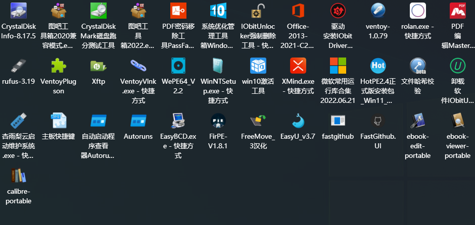

 ## 1. 实践类
> 系统系列：
  - Windows
    - [ ] win7系统装机、备份、修复、还原 
    - [ ] win8系统装机、备份、修复、还原 
    - [x] win10系统装机、备份、修复、还原 
    - [ ] win11系统装机、备份、修复、还原 

  - Linux
    - [ ] ubunto （安装）
    - [ ] Debian
    - [ ] CentOS
    - [ ] Deepin

  - macOS
    - [ ]  

  - Android 
    - [ ]
  - 鸿蒙
    - [ ]  

-----
 - Adobe系列
    - [x] Photoshop （熟练）
    - [ ] Premiere （入门级，不熟练）
    - [ ] Adobe Illustrator（熟悉）
    - [ ] Adobe Acrobat DC (基本使用)

-----
- 办公系列
    - [ ] WPS (基本使用)
    - [ ] office(熟悉)

-----
- others

> 硬件类（仅PC机）
1. CPU
    - [ ] Intel （了解）
    - [ ] AMD
    - [ ] 其他   
2. 主板 
    - 华硕
        - [x] 大师系列（基本命名规则，boss操作）
        - [ ] 
    - 技嘉
    - 
3. 硬盘
    - 机械
       - [x] 西数 （各品类）
       - [ ]  
    - SSD
       - [ ] 接口种类
       - [ ] 铠侠
       - [ ] 西数
       - [ ] 
4. 显卡 
   
    - 
    - 
5. 内存
6. 电源
7. 机箱
8. 显示器
9. 外设
    - [x] 移动硬盘
    - [ ] 鼠标
    - [ ] 键盘
    - [ ] 拓展
    - [ ] 耳机
    - [ ] 音响
    - [x] U盘
    - [ ] 麦克风
    - [ ] 

## 2. 理论类
### 计算机网络
- [ ]  
### 操作系统
- [ ] 
### 高级计算机语言
- [ ] java
### 数据结构与算法

