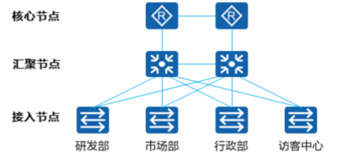

# 网络层概述

- 传输层负责建立主机之间进程与进程之间的连接，而网络层则负责数据从一台主机到另外一台主机之间的传递。
- 网络层的PDU被称为Packet（包）。
- 网络层也叫Internet层
	- 负责将分组报文从源主机发送到目的主机。
- 网络层作用
	- 为网络中的设备提供逻辑地址。
	- 负责数据包的寻径和转发。
	- 常见协议如[[IPv4]]，[[IPv6]]、[[ICMP]]，IGMP等。

- [[IPv4]]( Internet Protocol Version 4)，简称IP，是目前应用最广泛的网络层协议。
- [[#数据包分片]]
- [[#生存时间（Time to Live, TTL)]]

# 网络层协议

- 网络层经常被称为IP层。但网络层协议并不只是IP协议，还包括
	- [[ICMP]] ( Internet ControlMessage Protocol)协议
	- IPX（Internet Packet Exchange ) 协议
	- 。。。。。。

![[Pasted image 20221020163611.png]]

## IP协议

- 数据在网络层的封装，如果封装为IP协议，则被称为IP Packet（IP数据包）
- IP是Internet ProtoC。 Internet ProtoCol本身是一个协议文件的名称，该协议文件的内容非常少，主要是定义并阐述了IP报文的格式。
- 经常被提及的IP，一般不是特指Internet Protocol这个协议文件本身，而是泛指直接或间接与IP协议相关的任何内容。
- 作用：
	- 为网络层的设备提供逻辑地址
	- 负责数据包的寻址和转发
-  版本：[[IPv4]] (IP Version 4) [[IPv6]] (IP Version 6)

- IP协议有版本之分，分别是IPv4和IPv6。目前，Internet上的IP报文主要都是IPv4报文，但是逐步在向IPv6过渡。若无特别声明，本章所提及的IP均指IPv4。
- IPv4（Internet Protocol Version 4）协议族是TCP/IP协议族中最为核心的协议族。它工作在TCP/IP协议栈的网络层，该层与OSI参考模型的网络层相对应。
- IPv6（Internet Protocol Version 6）是网络层协议的第二代标准协议，也被称为IPng（IP Next Generation）。它是Internet工程任务组IETF（Internet Engineering Task Force）设计的一套规范，是IPv4（Internet Protocol Version 4）的升级版本。
-  在IP网络上，如果用户要将一台计算机连接到Internet上，就需要向因特网服务提供方ISP (Internet Service Provider ) 申请一个IP地址。

## 网络层协议工作过程

![[Pasted image 20221019191026.png]]

- 当采用IP作为网络层协议时，通信的双方都会被分配到一个“独一无二”的IP地址来标识自己。IP地址可被写成32位的二进制整数值形式，但为了方便人们阅读和分析，它通常被写成点分十进制的形式，即四个字节被分开用十进制表示，中间用点分隔，比如192.168.1.1。
- IP数据包的封装与转发：
	- 网络层收到上层（如传输层）协议传来的数据时候，会封装一个IP报文头部，并且把源和目的IP地址都添加到该头部中。
	- 中间经过的网络设备（如路由器），会维护一张指导IP报文转发的“地图”——路由表，通过读取IP数据包的目的地址，查找本地路由表后转发IP数据包。
	- IP数据包最终到达目的主机，目的主机通过读取目的IP地址确定是否接受并做下一步处理。
- 除了IP协议外，网络层中还有如OSPF、IS-IS、BGP等各种路由协议帮助路由器建立路由表，ICMP帮忙进行网络的控制和状态诊断。

# IP Packet（IP数据包）

- IP Packet（IP数据包），其包头主要内容如下：
	- Version：4 bit，4：表示为IPv4；6：表示为IPv6。
	- Header Length：4 bit，首部长度，如果不带Option字段，则为20，最长为60。
	- Type of Service：8 bit，服务类型。只有在有QoS差分服务要求时，这个字段才起作用。
	- Total Length：16 bit，总长度，整个IP数据包的长度。
	- Identification：16 bit，标识，分片重组时会用到该字段。
	- Flags：3 bit，标志位。
	- Fragment Offset：12 bit，片偏移，分片重组时会用到该字段。
	- Time to Live：8 bit，生存时间。
	- Protocol：8 bit，协议：下一层协议。指出此数据包携带的数据使用何种协议，以便目的主机的IP层将数据部分上交给哪个进程处理。
		- 常见值：
			- 1: ICMP, Internet Control Message；
			- 2: IGMP, Internet Group Management；
			- 6: TCP , Transmission Control Protocol；
 - 17: UDP, User Datagram Protocol。
- Header Checksum：16 bit，首部检验和。
- Source IP Address：32 bit，源IP地址。
- Destination IP Address：32 bit，目的IP地址。
- Options：可变，选项字段。
- Padding：可变，填充字段，全填0。
## 数据包分片

- 将报文分割成多个片段的过程叫做分片。
- 网络中转发的IP报文的长度可以不同，但如果报文长度超过了数据链路所支持的最大长度，则报文就需要分割成若干个较小的片段才能够在链路上传输。
- ![[Pasted image 20221020171505.png]]
- ![[Pasted image 20221020171519.png]]
- Identification：16 bit，发送主机赋予的标识，分片重组时会用到该字段。
-  Flags：3 bit，标志位。
	- 保留段位：0，保留。
	- 不分段位：1，表示“不能分片”；0，表示“能分片”。
	- 更多段位：1，表示“后面还有分片”；0，表示“最后一个数据片”。
- Fragment Offset：12 bit，片偏移，分片重组时会用到该字段。指出较长的分组在分片后，该片在原分组中的相对位置，与更多段位组合，帮助接收方组合分段的报文。

## 生存时间（Time to Live, TTL)
- TTL字段设置了数据包可以经过的路由器数目。
- 一旦经过一个路由器，TTL值就会减1，当该字段值为0时，数据包将被丢弃。
- ![[Pasted image 20221020171831.png]]
- ![[Pasted image 20221020171842.png]]
- Time to Live：8 bit，生存时间。可经过的最多路由数，即数据包在网络中可通过的路由器数的最大值。
- 报文在网段间转发时，如果网络设备上的路由规划不合理，就可能会出现环路，导致报文在网络中无限循环，无法到达目的端。环路发生后，所有发往这个目的地的报文都会被循环转发，随着这种报文逐渐增多，网络将会发生拥塞。
- 为避免环路导致的网络拥塞，IP报文头中包含一个生存时间TTL（Time To Live）字段。报文每经过一台三层设备，TTL值减1。初始TTL值由源端设备设置。当报文中的TTL降为0时，报文会被丢弃。同时，丢弃报文的设备会根据报文头中的源IP地址向源端发送[[ICMP]]错误消息。（注意：网络设备也可被配置为不向源端发送ICMP错误消息。）
## 协议号（Protocol）
- IP报文头中的协议号了将会继续处理该报文的协议。
- 即指出此数据包携带的数据使用何种协议，以便目的主机的IP层将数据部分上报给哪个进程处理。
- ![[Pasted image 20221020172326.png]]
- ![[Pasted image 20221020172335.png]]
- 目的端的网络层在接收并处理报文以后，需要决定下一步对报文如何处理。IP报文头中的协议字段标识了将会继续处理报文的协议。
- 该字段可以标识网络层协议，如[[ICMP]]（Internet Control Message Protocol，因特网控制报文协议，对应值0x01）；也可以标识上层协议，如TCP（Transmission Control Protocol，传输控制协议，对应值0x06）、UDP（User Datagram Protocol，用户数据包协议，对应值0x11）。

# 网络层技术

## 子网划分

### 子网划分的原因

- “有类编址”的地址划分过于死板，划分的颗粒度太大，会有大量的主机号不能被充分利用，从而造成了大量的IP地址资源浪费。
- 因此可以利用子网划分来减少地址浪费，即VLSM (Variable Length Subnet Mask)，可变长子网掩码。将一个大的有类网络，划分成若干个小的子网，使得IP地址的使用更为科学。

![[Pasted image 20221020184949.png]]

![[Pasted image 20221020184958.png]]

### 子网划分的实现

#### 1. 原网段分析

![[Pasted image 20221020185305.png]]

- 假设有一个C类网段地址：192.168.10.0；默认情况下，网络掩码为24位，包括24位网络位，8位主机位。
- 通过计算可知，这样的网络中，有256个IP地址。
#### 2. 向主机借位

![[Pasted image 20221020185532.png]]

- 现在，将原有的24位网络位向主机位去“借”1位，这样网络位就扩充到了25位，相对的主机位就减少到了7位，而借过来的这1位就是子网位，此时网络掩码就变成了25位，即255.255.255.128，或/25。
- 子网位：可取值0或取值1，则得到了两个新的子网。
- 通过计算可知，现在网络中，有128个IP地址。
#### 3. 计算子网网络地址
![[Pasted image 20221020185754.png]]

- 计算网络地址，主机位全为0：
	- 如果子网位取值0，则网络地址为192.168.10.0/25。
	- 如果子网位取值1，则网络地址为192.168.10.128/25。

#### 4. 计算子网广播地址

![[Pasted image 20221020185948.png]]

- 计算广播地址，主机位全为1：
	- 如果子网位取值0，则网络地址为192.168.10.127/25。
	- 如果子网位取值1，则网络地址为192.168.10.255/25。

#### 练习

![[Pasted image 20221020190131.png]]

![[Pasted image 20221020190143.png]]

- 实际网络规划中，会先规划主机多的子网络。

- 子网的网络地址分别为：
	- 192.168.1.0/28
	- 192.168.1.16/28
	- 192.168.1.32/28
	- 192.168.1.48/28
	- 192.168.1.64/28
	- 192.168.1.80/28
	- 192.168.1.96/28
	- 192.168.1.112/28
	- 192.168.1.128/28
	- 192.168.1.144/28
	- 192.168.1.160/28
	- 192.168.1.176/28
	- 192.168.1.192/28
	- 192.168.1.208/28
	- 192.168.1.224/28
	- 192.168.1.240/28

## 网络IP地址规划

- IP地址规划要和网络结构、路由协议、流量规划、业务规则等结合起来考虑。IP地址的规划应尽可能和网络层次相对应，应该是自顶向下的一种规划。
- 总得来说: IP地址规划的目标是：易管理、易扩展、利用率高。
- 参考规划原则:唯一性、连续性、扩展性、结构化、业务相关性

>IP地址规划范例

| 背景                                            | 地址类型 | 地址范围           |
|-----------------------------------------------|------|----------------|
| 例如: 某公司被分配了  192,168.0.0/16  网段地址 |  研发部所属网段| 192.168.1.0/24 |
|                                               |   市场部所属网段   | 192.168.2.0/24 |
|                                               |   行政部所属网段   | 192.168.3.0/24 |
|                                               |     访客中心所属网段 | 192.168.4.0/24 |
|                                               |    其他  | 。。。。。。。        |

- 规划原则：
	- 唯一性：一个IP网络中不能有两个主机采用相同的IP地址。
	- 连续性：连续地址在层次结构网络中易于进行路由汇总，大大缩减路由表，提高路由计算的效率、加速路由收敛。
	- 扩展性：地址分配在每一层次上都要有合理的预留，在网络规模扩展时能保证路由汇总所需的连续性。避免网络扩展造成的地址、路由重新规划。
	- 结构化、业务相关性：地址规划与网络拓扑结构和网络承载业务结合起来，便于路由规划和QoS部署。好的IP地址规划使得每个地址都具有实际含义，看到一个地址就可以大致判断出该地址所属的设备和对应的业务。

